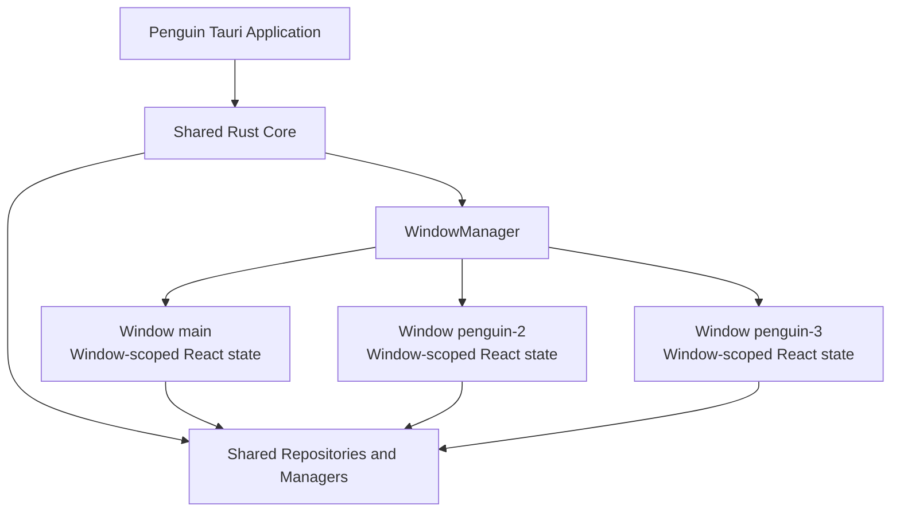

# Penguin 多窗口架构计划

> 状态：Future / Not Implemented  
> 修订日期：2026-08-31  
> 范围：Penguin Desktop / Tauri 2 / React 19  
> 计划执行：未来版本，当前不进入实施  
> 结论：**YES WITH CHANGES**；实施前必须重新核对仓库现状

## 1. 目标

为 Penguin 增加类似 Chrome 的多窗口能力，让用户能够在多个显示器上同时运行多个完整的 Penguin 窗口。

```text
Monitor 1              Monitor 2              Monitor 3
Penguin                 Penguin                 Penguin
REST / QAT              Terminal / QAT          Mongo / UAT
```

每个窗口必须：

- 拥有完整的 Penguin 导航能力。
- 独立选择当前模块、项目、环境和工作标签。
- 可以在 REST、Vault、Docs、Wiki 以及未来的 Terminal、Redis、Mongo 之间切换。
- 不因为另一个窗口的操作而丢失、隐藏或覆盖自己的 UI 状态。

## 2. 非目标

首版不实现：

- 分屏工作区。
- 右侧模块面板。
- 底部终端面板。
- 任意拖拽式 Pane 系统。
- 多个独立 Penguin 应用进程。
- 启动时恢复完整多显示器工作区。
- 在多窗口基础设施阶段同时交付 Terminal、Redis 和 Mongo 完整产品。

## 3. 架构决策

采用一个 Tauri 应用进程和多个完整 `WebviewWindow`。



核心原则：

> 一个 Penguin 应用，多个完整窗口。

> 共享定义和昂贵的原生服务；隔离当前选择和窗口 UI 状态。

> 按需加载、按需连接、按需创建、限制内存、明确清理。

## 4. 当前实现与计划冲突

下表只记录已经从当前源码确认的事实。

| 当前实现 | 代码位置 | 多窗口影响 |
| --- | --- | --- |
| Tauri 配置只声明一个初始窗口 | [`src-tauri/tauri.conf.json`](../../src-tauri/tauri.conf.json) | 需要新增运行时窗口创建入口 |
| Rust 已启用 Tauri `unstable` 多 WebView 能力 | [`src-tauri/Cargo.toml`](../../src-tauri/Cargo.toml) | 技术底座可以复用 |
| macOS 菜单故意移除 `close_window` | [`src-tauri/src/lib.rs`](../../src-tauri/src/lib.rs) | `Cmd+W` 目前不会关闭窗口 |
| React 使用 `Cmd+W` 关闭当前请求标签 | [`src/App.tsx`](../../src/App.tsx) | 与原计划的关闭窗口快捷键冲突 |
| `activeModule` 使用单一全局持久化 key | [`src/App.tsx`](../../src/App.tsx)、[`src/lib/persistence-keys.ts`](../../src/lib/persistence-keys.ts) | 最后写入的窗口会覆盖恢复状态 |
| 环境定义和当前环境使用全局 per-protocol key | [`src/hooks/useEnvironments.ts`](../../src/hooks/useEnvironments.ts)、[`src/lib/persistence-keys.ts`](../../src/lib/persistence-keys.ts) | 无法稳定支持 Window 1=QAT、Window 2=UAT |
| 每个 WebView 都有独立内存 cache，但没有跨窗口失效通知 | [`src/lib/app-persistence.ts`](../../src/lib/app-persistence.ts) | 共享设置可能在窗口之间静默分叉 |
| 原生内联 WebView 固定挂在 `main` | [`src-tauri/src/inline_webview.rs`](../../src-tauri/src/inline_webview.rs) | 次级窗口不能正确拥有自己的内联 WebView |
| `hide_all` 和 `close_all` 扫描整个应用的内联 WebView | [`src-tauri/src/inline_webview.rs`](../../src-tauri/src/inline_webview.rs) | 一个窗口可能隐藏或关闭另一个窗口的内容 |
| Vault、Docs、REST、Wiki 当前为静态 import | [`src/App.tsx`](../../src/App.tsx) | 每个新窗口都会加载全部模块代码 |
| 已存在 xterm 前端依赖和 Rust Redis 依赖 | [`package.json`](../../package.json)、[`src-tauri/Cargo.toml`](../../src-tauri/Cargo.toml) | 不代表 Terminal、Redis Explorer 已经完成 |

## 5. Phase 0：Window Scope Foundation

这是实现多窗口前必须完成的基础阶段。

### 5.1 窗口身份

每个窗口必须拥有应用级唯一 label：

```text
main
penguin-2
penguin-3
penguin-4
```

禁止用模块名作为 label，因为以下场景必须合法：

```text
Window main      -> REST
Window penguin-2 -> REST
Window penguin-3 -> Terminal
```

建议新增前端只读上下文：

```ts
interface PenguinWindowContext {
  label: string;
  isPrimary: boolean;
  initialModule?: MainModule;
  initialProjectId?: string;
  initialEnvironmentId?: string;
}
```

创建窗口时只传递轻量初始化参数，不复制来源窗口的完整 React state。

### 5.2 状态边界

| 状态 | 归属 | 说明 |
| --- | --- | --- |
| 应用设置、主题默认值 | Shared | 修改后应通知其他窗口 |
| 项目和环境定义 | Shared | 定义共享，当前选择不共享 |
| Credential metadata、Vault 数据 | Shared | 必须保持单一事实来源 |
| Saved requests、历史记录 | Shared | 数据共享，当前选中项按窗口隔离 |
| Package registry、安装状态 | Shared | 安装操作需要应用级串行化 |
| `activeModule` | Window | 每个窗口独立 |
| 当前项目、当前环境 | Window | 每个窗口独立 |
| REST/gRPC 工作标签与当前标签 | Window | 每个窗口独立 |
| 当前 Redis key、Mongo collection/document | Window | 每个窗口独立 |
| Terminal tabs | Window | V1 由创建它的窗口拥有 |
| 导航历史、滚动位置 | Window | 仅窗口 UI 状态 |
| 窗口位置、大小、monitor | Window | V2 恢复功能使用 |

### 5.3 持久化命名空间

窗口状态不能继续直接使用全局 key。

建议格式：

```text
window:{windowLabel}:activeModule
window:{windowLabel}:activeEnvironment:{protocol}
window:{windowLabel}:tabs
window:{windowLabel}:activeTab
window:{windowLabel}:navigation
```

共享定义继续使用稳定的全局 key：

```text
penguin-grpc-web-environments
penguin-rest-environments
penguin-vault-data
penguin-saved-requests
```

`main` 窗口应兼容现有 key，避免升级后丢失用户状态。次级窗口使用新命名空间。

V1 只要求窗口 reload 后恢复；跨应用启动恢复次级窗口属于 V2。

### 5.4 跨窗口共享状态同步

每个 WebView 都有独立 JavaScript 内存，因此 SQLite 写入不能自动更新其他窗口的 cache。

共享状态写入成功后，应发送带 revision 的应用事件：

```text
shared-state://changed
```

事件只携带轻量元数据：

```json
{
  "key": "penguin-rest-environments",
  "revision": 42,
  "sourceWindow": "penguin-2"
}
```

其他窗口收到事件后重新读取对应数据。不要通过事件广播敏感值或完整大型对象。

### 5.5 全局副作用所有权

以下逻辑只能由主窗口或 Rust app-level service 执行一次：

- Updater 检查与更新提示。
- Release welcome。
- Prevent Sleep 初始化。
- Package registry 后台刷新。
- Wiki 自动刷新。
- 应用级 watcher、MCP 和 Knowledge runtime 生命周期。

普通窗口可以读取这些服务的状态，但不能各自启动一份后台任务。

## 6. WindowManager

新增统一的 Rust Window Manager。模块不能分别实现自己的窗口创建逻辑。

建议命令边界：

```text
create_penguin_window(initialContext?)
close_penguin_window()
get_penguin_window_context()
list_penguin_windows()
```

建议创建流程：

```text
Cmd+Shift+N
 -> create_penguin_window()
 -> generate unique label
 -> build WebviewWindow
 -> load the normal Penguin frontend
 -> frontend reads its window context
 -> show and focus window
```

模块打开流程：

```text
REST -> Open in New Window
 -> create_penguin_window({ initialModule: "rest", ... })
 -> new full Penguin window opens on REST
```

窗口创建必须在 Rust 侧统一执行，避免给前端开放不必要的通用窗口创建权限。

## 7. 快捷键与菜单

当前 Penguin 已使用 `Cmd+W` 关闭请求标签。为了避免快捷键行为根据窗口或标签状态变化，采用明确且稳定的规则：

```text
Cmd+Shift+N  New Penguin Window
Cmd+W        Close Current Request Tab
Cmd+Shift+W  Close Current Penguin Window
```

原计划中的 `Cmd+W = Close Window` 不再采用。

关闭最后一个窗口时遵循 macOS 应用生命周期行为；是否保持应用后台存活需要在实现 Spike 中验证并形成单独产品决策。

## 8. 原生内联 WebView 所有权

内联 WebView 必须属于创建它的 Penguin 父窗口。

子 WebView label 使用窗口命名空间：

```text
main:inline:{shortcutId}
penguin-2:inline:{shortcutId}
```

所有操作都必须携带或从调用方解析 `parentWindowLabel`：

- open
- list
- show/hide
- set bounds
- close
- reload/navigation
- purge data

窗口关闭时只关闭该窗口拥有的子 WebView。清理共享 cookie/data directory 属于显式全局操作，不得与普通窗口关闭混在一起。

在这项改造完成前，次级窗口必须禁用会创建内联 WebView 的功能。

## 9. 资源管理与清理

昂贵原生资源放在应用级 manager 中，但每个资源必须记录消费者或所有者。

```text
Shared Rust Core
├── WindowManager
├── TerminalManager
├── RedisConnectionManager
├── MongoConnectionManager
└── App/Environment Repository
```

### Terminal V1

- 创建 Terminal 模块不会自动创建 shell。
- 只有 `New Terminal` 才创建 PTY。
- PTY 记录 `ownerWindowLabel`。
- 关闭窗口会终止该窗口拥有的全部 PTY。
- xterm.js buffer 是终端输出的主要前端副本。
- scrollback 默认限制为 5,000–10,000 行，并允许后续配置。

### Redis

- 打开 Redis 模块不会自动连接全部目标。
- 使用 `SCAN`，禁止普通浏览流程使用 `KEYS *`。
- key 列表分页并虚拟化。
- value 按需读取，大值截断并提供显式加载。
- 连接使用 consumer lease/reference count；最后一个消费者释放后才断开。

### Mongo

- 打开 Mongo 模块不会自动连接全部目标。
- 查询必须有 `limit`，首版建议 50 或 100。
- 使用分页或 cursor，不在前端保留无限结果。
- 大型 document 避免跨多个 React state 层复制。
- 连接遵循与 Redis 相同的 consumer ownership 规则。

## 10. 模块加载策略

每个窗口只加载实际进入的主要模块。

当前静态导入的 Vault、Docs、REST、Wiki 应改为 route/component-level lazy import。首屏核心模块可以基于测量结果保留 eager load，但必须记录原因和内存差异。

```text
New empty window
 -> no Terminal chunk
 -> no PTY
 -> no Redis connection
 -> no Mongo connection
```

## 11. 实施路线

### Phase 0 — Window Scope Foundation

- Window context。
- shared/window 状态分类。
- 窗口持久化命名空间。
- 跨窗口共享状态失效通知。
- 主窗口副作用门禁。
- 内联 WebView 风险隔离。

验收：两个 WebView 在同一进程内运行时，不会覆盖彼此的模块、环境和标签状态。

### Phase 1 — Window Infrastructure

- `WindowManager`。
- New Window。
- Close Window。
- 唯一 label。
- 每个窗口渲染完整 Penguin shell。
- 动态窗口标题。

验收：连续创建五个窗口并逐一关闭，其余窗口保持可用。

### Phase 2 — Client/REST Vertical Slice

- Client 和 REST 支持多窗口。
- 每窗口独立标签、请求选择、项目和环境。
- reload 后保持当前窗口状态。

验收：Window 1 使用 REST/QAT，Window 2 使用 REST/UAT，互不影响。

### Phase 3 — Open in New Window

- 统一 `openModuleInNewWindow(module, context?)` 前端 API。
- Client、REST、Docs、Wiki 按验证结果逐步启用。
- 不允许模块绕过 Window Manager 自己创建窗口。

### Phase 4 — Inline WebView Window Scoping

- parent window ownership。
- child label namespace。
- hide/close/list 仅作用于当前父窗口。
- 窗口关闭清理。

完成后才能在次级窗口启用相关 Browser/Vault 能力。

### Phase 5 — Terminal

- PTY backend。
- Tauri channel。
- xterm.js UI。
- per-window ownership。
- bounded scrollback。
- 长时间运行验证。

### Phase 6 — Redis Explorer

- lazy connect。
- `SCAN` pagination。
- value truncation/load-more。
- virtualization。
- connection ownership。

### Phase 7 — Mongo Explorer

- lazy connect。
- bounded query。
- pagination/cursor。
- document virtualization。
- connection ownership。

### Phase 8 — Performance and Memory

- 模块 lazy import。
- bounded caches。
- 前端 unmount cleanup。
- 原生资源 cleanup。
- 4–8 小时长跑测试。

### Phase 9 — Workspace Restore（Optional V2）

- 持久化窗口数量、位置、大小和 monitor。
- 恢复模块、项目和环境。
- 处理 monitor 缺失、分辨率变化和窗口越界。

该阶段不得阻塞 V1。

## 12. 验收测试

### 窗口

- [ ] `Cmd+Shift+N` 可以连续创建五个窗口。
- [ ] 每个窗口拥有完整导航。
- [ ] 关闭一个窗口不会关闭或重置其他窗口。
- [ ] `Cmd+W` 只关闭当前请求标签。
- [ ] `Cmd+Shift+W` 只关闭当前窗口。
- [ ] 窗口标题随模块和环境变化。
- [ ] 窗口可正常移动到其他显示器。

### 状态

- [ ] Window 1=QAT、Window 2=UAT 可以同时存在。
- [ ] 每个窗口的模块选择独立。
- [ ] 每个窗口的 Client/REST 标签独立。
- [ ] 窗口 reload 后恢复自己的状态，不读取另一个窗口的选择。
- [ ] 共享设置变更会通知并刷新其他窗口。
- [ ] 同时写入共享设置时有确定的冲突策略。

### 原生 WebView

- [ ] Window 2 打开内联 WebView 时，它属于 Window 2。
- [ ] Window 2 切换模块不会隐藏 Window 1 的内联 WebView。
- [ ] 关闭 Window 2 只清理 Window 2 的子 WebView。
- [ ] 普通窗口关闭不会误删共享浏览数据。

### 资源

- [ ] 新建空窗口不创建 PTY。
- [ ] 新建空窗口不创建 Redis 连接。
- [ ] 新建空窗口不创建 Mongo 连接。
- [ ] 关闭 Terminal 窗口会终止其 PTY。
- [ ] Redis/Mongo 最后一个消费者退出后连接可释放。
- [ ] 没有 orphan child process。

### 副作用

- [ ] Updater 不会按窗口数量重复检查或弹窗。
- [ ] Prevent Sleep source 数量不随窗口数量增长。
- [ ] Registry/Wiki 后台刷新不会为每个窗口重复启动。

### 内存

- [ ] 记录一个窗口的 RAM/CPU/WebView process baseline。
- [ ] 记录两个和五个 idle window 的增量 RAM。
- [ ] 连续打开/关闭窗口 20 次后 RSS 回落到合理范围。
- [ ] 4–8 小时运行没有持续线性增长。
- [ ] Terminal scrollback、Redis key 列表和 Mongo results 都有硬边界。

桌面行为必须使用：

```bash
pnpm tauri dev
```

浏览器中的 `pnpm dev` 只能验证 React 行为，不能证明 Tauri 窗口、菜单、原生 WebView 或资源清理正确。

## 13. 性能场景

### Baseline

```text
1 window
Client/REST idle
```

### Multi-window infrastructure

```text
Window 1 -> Client
Window 2 -> REST
Window 3 -> Docs
```

### Future heavy scenario

```text
Window 1 -> REST
Window 2 -> Terminal with 5 tabs
Window 3 -> Mongo
Window 4 -> Redis
```

成功标准不是零内存增长，而是：

- 新增窗口的内存增长可解释且稳定。
- 关闭窗口后大部分窗口专属资源可以释放。
- 长时间运行没有无界增长。
- 同等工作流下优于同时运行 Penguin、Warp、MongoDB Compass 和 RedisInsight。

## 14. 工期与交付边界

以下为单工程师的粗略估算，不是承诺日期：

| 范围 | 估算 |
| --- | --- |
| 技术 Spike | 2–3 天 |
| Phase 0–3 多窗口基础设施 | 2–3 周 |
| 原生内联 WebView 窗口化 | 3–5 天 |
| Terminal | 2–3 周 |
| Redis Explorer | 1–2 周 |
| Mongo Explorer | 2–3 周 |
| 性能与长跑验证 | 3–5 个工程日，加实际运行时间 |

完整顺序交付预计约 8–12 个工程周；包含 UX 打磨、返工和稳定性观察时，10–14 个日历周更现实。

## 15. V1 Definition of Done

V1 只覆盖多窗口基础设施和已存在模块，不要求 Terminal、Redis、Mongo 完成。

```text
Launch Penguin

Window main
 -> REST
 -> QAT

Cmd+Shift+N

Window penguin-2
 -> REST
 -> UAT

Move windows to different monitors
Reload each window
Close penguin-2
```

完成条件：

- 两个窗口都保持完整导航能力。
- 模块、环境和标签选择独立。
- 共享设置保持一致。
- reload 不发生跨窗口状态污染。
- 关闭次级窗口不影响主窗口。
- 不启动任何未使用的原生连接或子进程。
- 没有跨窗口隐藏、关闭原生子 WebView 的问题。
- 重复开关窗口后资源能够稳定回收。

## 16. 尚未验证的事项

实现前的 Spike 必须确认：

- 当前 Tauri capability 配置对运行时窗口创建和关闭的具体要求。
- macOS 关闭最后一个窗口后的目标应用生命周期。
- `main` 旧持久化 key 的迁移与兼容策略。
- 跨窗口共享状态采用 Tauri event、Rust repository subscription 或数据库 revision polling。
- 当前 xterm/Redis 依赖对应的实际生产模块完成度。
- PTY 和 Mongo driver 的最终技术选型。
- 多 WebView 在目标 macOS 版本上的实际 RAM 增量。

在这些项目得到源码或运行时证据前，不应把它们标记为已完成。
