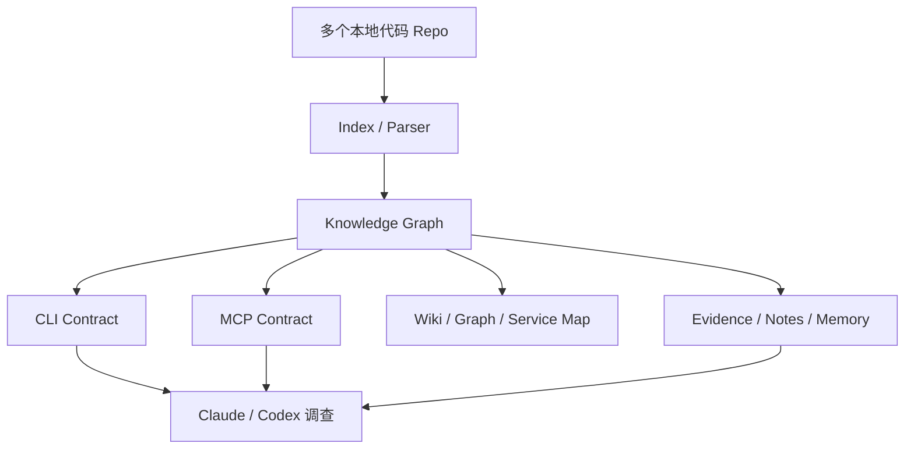

# Penguin Wiki 能力说明与竞品对比

> 文档日期：2026-08-30  
> 适用范围：Penguin 内部版，优先服务 Claude Desktop、Claude Code、Codex  以及其他 MCP-capable coding agents  
> 结论性质：工程能力评估，不是统一 benchmark，也不是对竞品的完整实机测试

## 1. 一句话结论

Penguin Wiki 不是普通的 Markdown 笔记工具，也不是单纯的 Graph View。它的目标是把多个代码仓库、服务、接口、符号、调用关系、证据和调查记录，整理成一个可以被 Claude 和 Codex 持续查询的本地知识层。

Penguin 当前最有竞争力的方向是：

- 多 Repo、跨 Service 的代码关系调查；
- CLI 和 MCP 使用同一套 capability contract；
- stable node ID、cursor、revision、freshness 和 proof status；
- 对 `partial`、`lower_bound`、`external`、`unresolved` 和 `not_proven` 保持诚实；
- Tauri 应用、稳定 launcher、CLI 和 MCP runtime 的统一交付；
- 为 Agent-to-Agent handoff 生成可复用的调查上下文。

但 Penguin 目前还不能声称全面领先所有竞品。最主要的未闭环部分是：真实 Claude/Codex fresh session 的 MCP reload 证明、签名 updater、动态运行时/反射调用的完整性、以及 freshness/coverage telemetry 的一致性。

## 2. Penguin Wiki 到底是什么

### 2.1 它不是单一的“知识图谱页面”

Penguin Wiki 由四层组成：



| 层 | 作用 | 典型内容 |
| --- | --- | --- |
| Index | 读取和索引本地代码与文档 | files、symbols、endpoints、services、logs |
| Graph | 保存结构化实体和关系 | `calls`、`imports`、`references`、`depends_on`、`invokes_dynamic` |
| Contract | 给 CLI 和 MCP 提供统一能力 | search、context、flow、affected、path、architecture、service graph |
| Evidence | 记录证据、限制和后续调查 | freshness、coverage、proof status、notes、handoff、negative-result rules |

### 2.2 当前已实现的主要能力

当前 capability matrix 同时列出 CLI 和 MCP 的实现契约，涵盖以下类别：

| 能力类别 | Penguin 能做什么 |
| --- | --- |
| 发现 | repository status、search、files、file symbols、endpoints、capabilities |
| 符号关系 | get node、callers、callees、context、locate、explain |
| 路径和影响 | flow、path、affected、impact、dependency path |
| 图谱 | local graph、repository graph、service graph、communities、timeline |
| 架构 | architecture、package dependencies、dead code、analyze repository |
| 证据 | evidence target、investigation plan/capture、doctor、validate、repair |
| Wiki | notes、backlinks、tags、links、sources、ontology、saved queries |
| Agent continuity | memory、handoff、stable IDs、cursor continuation、runtime diagnostics |
| MCP 生命周期 | install、reconfigure、health check、runtime build ID、outdated-session detection |

注意：能力矩阵里的 `implemented` 代表代码和 contract 已存在；它不自动代表每一台机器上的外部 MCP client 已经成功加载，也不代表所有动态代码关系都能被静态索引证明。

### 2.3 已移除能力：语义 / 向量搜索（semantic / vector search）

Penguin 早期曾包含一套基于 Nomic embedding 模型和 ONNX runtime 的语义（向量）搜索子系统：`knowledge.semantic_status`、`knowledge.semantic_control` 两个 capability、独立的 `VectorStore`、索引管线里的 embedding 阶段、后台语义 worker，以及前端 `SemanticWorkerPanel`。经过工程评估（见 [`docs/quality/penguin-knowledge-power-roadmap-claude-deepseek.md`](../quality/penguin-knowledge-power-roadmap-claude-deepseek.md)）确认它从未真正打通到生产可用状态——一直停留在基础设施骨架阶段，会在真实使用中出现"界面看起来支持 semantic search，运行时却没有向量、没有可用扩展"的危险状态。因此这套子系统已被整体移除，这是一次移除而不是功能回退；当前不存在任何真正执行语义搜索的 CLI verb、MCP tool 或 Tauri command。

移除过程中，出于成本收益考虑，刻意保留了三处"表面仍可见、但已经失效"的残留，特此说明，避免被误读为移除不彻底或遗留 bug：

1. **仍被声明、但已死的 capability。** `packages/knowledge-contracts/src/semantic.ts` 以及 `knowledge.semantic_status`/`knowledge.semantic_control` 两个 capability id 仍然保留在 contracts manifest 里——这也是为什么本仓库里自动生成的 [Capability Matrix](./capability-matrix.md)、[CLI Reference](./cli-reference.md)、[MCP Reference](./mcp-reference.md) 目前仍会把它们列为 `available`/`implemented`。但背后已经没有任何真正的 CLI/MCP/Tauri 实现在响应它们。彻底清除这两个声明需要同时重写生成式 onboarding 文案和一份 golden test snapshot，被判定为一次独立、更彻底的后续任务，不在本轮移除范围内。
2. **仍被接受、但已失效的搜索选项。** 通用搜索 API 的 `options.semantic: "off" | "fallback" | "blend"` 字段仍会被接受（避免破坏还在传这个字段的旧客户端），但搜索引擎现在无条件忽略它，始终只返回确定性的 graph/lexical/source 结果。这与 `mode` 字段不同——`mode` 已经彻底不再接受 `"semantic"` 这个取值，属于完全移除。
3. **过时的原生运行时清单。** `src-tauri/src/knowledge.rs` 里的 runtime-integrity manifest（`native_runtime_dependencies()` / `versioned_runtime_manifest()`）仍然把已删除的 `nomic-embed-text-v1.5` 模型文件、以及不再随包分发的 `onnxruntime-node`/`sharp` 列为预期的原生依赖，其 `model_hash` 字段目前是一个永久占位值而非真实哈希。这是它与 `packages/knowledge-cli/src/runtime-identity.ts` 之间一次跨进程运行时握手协议的一部分，需要单独、谨慎地调查后才能安全修正，因此本轮移除有意未触碰它。

## 3. 与其他工具的定位对比

以下比较按“代码 Agent 是否能可靠使用知识”这个目标，而不是按普通笔记软件的功能数量比较。

| 工具 | 核心定位 | 数据来源 | 图谱/关系类型 | Agent 接入 | 最适合的场景 | 主要限制 |
| --- | --- | --- | --- | --- | --- | --- |
| **Penguin** | 企业内部代码知识层 | 多 Repo、代码、接口、运行证据、Wiki notes | symbols、calls、imports、endpoints、services、evidence、dynamic edges | CLI + MCP；目标是 Claude/Codex 长期使用 | 跨服务调查、影响分析、API/endpoint 追踪、Agent handoff | 生态较新；fresh-session、签名升级和动态 dispatch 仍需最终证明 |
| **Obsidian** | 人类知识管理和 Markdown vault | 人工笔记、Markdown、properties、attachments | Markdown links、backlinks、tags、Canvas connections | 主要靠插件、脚本或外部 MCP | 个人知识库、文档、会议记录、人工整理的 Wiki | 不会自动理解代码调用链、DI、RPC、跨 Repo 服务关系 |
| **CodeGraph** | 通用代码智能和 IDE 导航 | 代码库 | files、functions、classes、imports、call chains | MCP、VS Code、JetBrains | 多语言代码导航、IDE 内理解、通用代码图 | 与企业运行证据、跨服务调查和 Penguin 的证据边界相比，需要实际场景验证 |
| **Understand Anything** | 多 Agent 代码理解和 onboarding | 代码、文件、依赖、架构信息 | knowledge graph、architecture layers、guided tours | Claude、Codex、Cursor、Copilot 等插件/工作流 | 新人 onboarding、domain explanation、diff explanation、学习路线 | 分析流程更依赖 Agent 生成；确定性、证据分层和企业 runtime 生命周期需要单独验证 |
| **Graphify** | Agent-first 本地代码知识图谱 | 本地代码和可选文档 | AST entities、typed directed edges、calls、imports、references | CLI skill + MCP，面向多个 coding assistants | 低 token、可审计路径、本地开源代码图谱 | 与 Penguin 的企业多 Repo、服务级调查、证据/运行时控制面相比，需看具体集成深度 |

### 3.1 外部工具的事实边界

- Obsidian 官方 Graph View 展示 Vault 中笔记及其内部链接；Local Graph 展示当前笔记的连接范围。Canvas 是自由布局的笔记、附件和网页连接空间。它很适合人工知识组织，但不能因此推导出它具备代码语义图能力。参考：[Obsidian Graph View](https://obsidian.md/help/plugins/graph)、[Obsidian Canvas](https://obsidian.md/help/Plugins/Canvas)。
- CodeGraph 的官方 README 描述了语义代码图、42 个 MCP tools、38 种语言，以及 VS Code 和 JetBrains 集成。参考：[CodeGraph README](https://github.com/codegraph-ai/CodeGraph/blob/main/README.md)。
- Understand Anything 的官方 README 描述了多 Agent pipeline、`knowledge-graph.json`、dashboard、onboarding、domain 和 diff 能力。参考：[Understand Anything README](https://github.com/razor-ai/understand-anything)。
- Graphify 官方文档描述了本地 tree-sitter AST 解析、typed directed edges、`EXTRACTED / INFERRED / AMBIGUOUS` provenance，以及 CLI skill 和 MCP 两种接入方式。参考：[Graphify concepts](https://graphify.com/concepts)。

这些是官方定位和文档声明，不等于本项目已经对每个竞品做了同一仓库、同一问题、同一模型、同一 token budget 的实机 benchmark。

## 4. 逐项能力矩阵

评分含义：

- `强`：当前产品方向和实现已经明显覆盖；
- `中`：存在能力，但覆盖范围或验证证据不足；
- `弱`：不是该工具的主要目标；
- `未证明`：接口或设计存在，但本轮没有足够运行证据。

| 维度 | Penguin | Obsidian | CodeGraph | Understand Anything | Graphify |
| --- | --- | --- | --- | --- | --- |
| 人类手工写 Wiki | 中 | **强** | 弱 | 中 | 弱-中 |
| Markdown / 文档管理 | 中-强 | **强** | 弱 | 中 | 中 |
| 自动代码索引 | **强** | 弱 | **强** | 强 | **强** |
| symbol-level navigation | **强** | 弱 | **强** | 强 | 强 |
| caller / callee / flow | **强** | 弱 | **强** | 中-强 | **强** |
| endpoint / RPC 视角 | **强** | 弱 | 中 | 中 | 中 |
| 跨 Repo / 跨 Service | **强** | 弱 | 中 | 中 | 中-强 |
| 影响分析 | **强** | 弱 | 强 | 中-强 | 强 |
| 动态调用和反射的诚实标记 | 中-强 | 不适用 | 未知 | 中 | **强** |
| 证据 provenance | **强** | 中 | 中 | 中 | **强** |
| `not_proven` 负面结论保护 | **强** | 不适用 | 未知 | 未知 | 中-强 |
| MCP 原生支持 | **强** | 依赖插件 | **强** | 依赖插件/工作流 | **强** |
| CLI fallback | **强** | 弱 | 中 | 中 | **强** |
| fresh-session 连续性 | 设计强，运行证明仍需完成 | 不适用 | 未知 | 工作流级 | 工作流级 |
| runtime upgrade / stale session | **差异化强项，仍需 signed build 闭环** | 不适用 | 未知 | 未知 | 未知 |
| IDE 集成 | 中 | 弱 | **强** | 中-强 | 中 |
| 可视化图谱 | 强 | **强**（笔记图） | 强 | **强** | **强** |
| 适合企业内部不公开代码 | **强** | 强 | 中-强 | 取决于部署 | **强** |

## 5. Penguin 明确比不过的地方

### 5.1 比不过 Obsidian 的地方

Penguin 不应该试图在所有个人知识管理能力上替代 Obsidian。Obsidian 的优势包括：

- 极低门槛的 Markdown 编辑；
- 成熟的 backlinks、tags、properties 和 Canvas 使用习惯；
- 大量社区插件和个人工作流；
- 人可以自由组织知识，不需要等待索引器理解内容。

Penguin 当前的 Wiki 能力更像“面向 Agent 的结构化知识控制面”，而不是“最好的个人笔记编辑器”。如果用户要写日记、会议记录、读书笔记或自由组织资料，Obsidian 更合适。

### 5.2 可能比不过 CodeGraph 的地方

CodeGraph 的公开定位更偏向通用代码 intelligence 和 IDE integration。它可能在以下方面领先或更成熟：

- 多语言 parser 覆盖；
- VS Code / JetBrains 内即时体验；
- 直接服务普通开发者的 IDE navigation；
- 更标准化的单 Repo 代码理解路径。

Penguin 的目标不是用漂亮的 IDE symbol panel 赢过所有代码导航工具，而是把跨 Repo、服务边界、运行证据、MCP contract 和 Agent handoff 放在一起。若 Penguin 的用户只需要“跳到定义”和“查看调用者”，CodeGraph 可能已经足够，Penguin 的额外复杂度未必值得。

### 5.3 可能比不过 Understand Anything 的地方

Understand Anything 更强调多 Agent 学习流程，因此可能在以下方面体验更好：

- 自动生成新人 onboarding；
- 以学习顺序解释架构；
- domain knowledge 和 guided tour；
- 直接通过插件命令启动理解流程。

Penguin 的优先级是确定性查询、证据边界和可复现 handoff。它的说明可能更谨慎、更像调查报告，但初次使用时不一定比 Understand Anything 更“有故事感”或更容易读懂。

### 5.4 可能比不过 Graphify 的地方

Graphify 是 Penguin 最接近的直接对手。Graphify 已经把以下卖点表达得很清楚：

- 本地 AST 解析；
- typed directed graph；
- path-based answer；
- `EXTRACTED / INFERRED / AMBIGUOUS` provenance；
- CLI skill 和 MCP；
- 面向多个 Agent 的快速安装；
- 低 token 消耗。

如果用户只要一个轻量、开源、快速安装、对单个 Repo 做 AST 图谱的工具，Graphify 可能比 Penguin 更简单、更快上手，也可能更容易获得社区采用。

Penguin 需要通过真实场景证明自己的额外价值：多 Repo 注册、跨服务 link、endpoint / service map、证据记录、revision alignment、稳定 runtime 和内部部署控制。如果这些能力没有被稳定证明，Penguin 只是一个更复杂的 Graphify，而不是更强的产品。

## 6. Penguin 目前最有机会领先的地方

### 6.1 跨 Repo、跨 Service 的调查

当前 Penguin 索引视图已经包含多个 Repo、服务和 endpoint，架构查询显示 26 个 service/endpoint 节点组以及 163 条 cross-service links。这个方向明显不同于只围绕单 Repo 的代码图。

它可以回答的不是只有：

> “这个函数的 caller 是谁？”

而是进一步回答：

> “这个 endpoint 从哪个 service 进入，经过哪些符号，影响哪些 Repo，哪些边是 parser 证据，哪些边仍然只是 lower-bound？”

这更接近企业内部事故调查和变更评估，而不是普通代码浏览。

### 6.2 把“无法证明”作为产品能力

很多代码理解工具会把空数组、没有搜索结果或一条不完整路径，直接变成“没有调用者”“没有影响”“没有数据层”。Penguin 当前设计要求 Agent 区分：

| 状态 | 含义 |
| --- | --- |
| `proven` | 当前证据足以支持结论 |
| `not_proven` | 没有足够证据，不能当作不存在 |
| `partial` | 路径或关系只覆盖了一部分 |
| `lower_bound` | 结果至少包含这些，但不保证完整 |
| `external` | 关系指向外部库、服务或不可见边界 |
| `unresolved` | 解析器或索引器无法解析目标 |
| `stale` | 结果可能和当前源代码/版本不一致 |

这是 Penguin 面向 Claude/Codex 的关键差异：它不只提供答案，也提供答案的安全使用边界。

### 6.3 CLI / MCP contract parity

Penguin 的能力矩阵、CLI reference 和 MCP reference 都从 canonical capability manifest 生成。理想状态下，同一个 capability 在 CLI 和 MCP 应该拥有：

- 相同的 capability ID；
- 相同的输入字段和验证规则；
- 相同的输出 envelope；
- 相同的 error code；
- 相同的 capability hash；
- 相同的 revision、freshness、coverage 和 proof metadata。

这对 Claude 和 Codex 很重要，因为 Agent 可以在 MCP 暂时不可用时切换 CLI，而不需要学习两套完全不同的产品语义。

### 6.4 Agent-to-Agent handoff

Penguin 可以把调查结果压缩成 Agent B 能继续使用的 packet：

```text
repo: FPMS-NT
branch: brazil-v2
commit: <commit>
symbol: node:<stable-id>
endpoint: node:<stable-id>
flow: endpoint -> handler -> proto
affectedCandidateCount: 9
proofStatus: not_proven
limitation: data-layer reachability is not proven
nextCommands: context / flow / callers
```

如果 Agent B 使用新进程仍然能够复用这些 IDs、revision 和 cursor，就能减少重复搜索和重复读取源码的成本。这是 Penguin 比单纯笔记图谱更有价值的地方。

## 7. 当前已验证与未验证的边界

### 7.1 已有较强证据的部分

- CLI typecheck 和完整测试曾通过；
- 最近 targeted knowledge/MCP/parity tests 为 49 pass、0 fail；
- 更宽的 targeted suite 为 52 pass、0 fail；
- stable launcher 的 runtime-A → runtime-B upgrade replay 通过；旧 MCP session 能报告 outdated，fresh session 能加载新 runtime；
- 最新应用 bundle 内的 MCP `initialize` 检查通过；
- `node:<id>` 的动态 continuation、caller/callee、affected、分页和结构化错误已有大量测试；
- duplicate capability ID 的问题已经处理，curated listing 不再重复暴露相同 canonical capability；
- 当前 Tauri unsigned build 可以成功生成 `.app` 和 `.dmg`。

### 7.2 仍然不能写成“已经完美”的部分

- 真实 Claude Desktop、Claude Code、Codex fresh session 的 MCP `tools/list`、schema 和实际调用链仍需外部 session 最终确认；
- Tauri signed updater 还需要 `TAURI_SIGNING_PRIVATE_KEY`，否则 build 会在 updater artifact signing 阶段失败；
- 动态 DI、reflection、framework magic、dynamic import 和 interface dispatch 不可能只靠静态图谱完整证明；
- 最近评估中出现过 coverage/freshness telemetry 不一致：某些审计显示 0 unresolved/0 stale，另一份 fresh evaluation 又记录了 stale symbols 和大量 unresolved references；
- endpoint identity 在部分路径对 `node:<id>` 和 bare ID 的接受不一致；
- inventory 类输出的 evidence envelope 曾比 graph 查询不完整；
- hard page limit 下，不能仅凭前几页就声称 endpoint queue 已完全耗尽；
- 外部 MCP 环境不可用时，CLI 通过不等于 Claude/Codex 真的已经使用了新 MCP。

## 8. “完美”应该如何定义

“完美”不应该定义成“图上有很多节点”或“所有查询都返回结果”。对于 Penguin，完美应该是一个可重复的工程验收标准：

| 完美标准 | 通过条件 |
| --- | --- |
| 可发现 | 新 Agent 能在第一轮找到 capabilities、status、coverage、search、context、flow 和 fallback |
| 可复现 | 相同 repo、branch、commit 和 query 在新进程中得到一致的 identity 和 scope |
| 可连续 | Agent A 的 node ID、endpoint ID、cursor 和 handoff 能被 Agent B 直接继续使用 |
| 可审计 | 每条关键关系包含 locator、origin、confidence、freshness 和 proof status |
| 可诚实 | 空结果不会自动变成“没有”；覆盖不足时必须输出 `not_proven` |
| 可完整 | endpoints、filesymbols、deadcode 的 cursor 都能证明 page 1、middle page、final page、invalid cursor 和 wrong scope |
| 可平等 | CLI 和 MCP 的 capability hash、schema、error envelope 和结果语义一致 |
| 可更新 | 新版本安装后，旧 client 能发现 outdated，用户无需手动寻找旧 runtime |
| 可恢复 | MCP 不可用时，CLI fallback 可用；错误信息包含可执行 remediation |
| 可控 | unsigned build、signed build、stable launcher 和 bundle 内 runtime 的版本关系可检查 |
| 可解释 | onboarding 能告诉新用户下一步该查什么、什么时候必须读源码 |
| 可扩展 | 新 Repo、语言、服务和证据来源不会破坏已有 node ID 与 contract |

达到这套标准后，Penguin 可以称为“对 Claude/Codex 的可靠内部知识平台”。这比宣称“AI 已经完全理解代码”更准确，也更有长期价值。

## 9. 达到 95–100 分还需要什么

### P0：必须完成

1. **真实 fresh-session MCP 验收**
   - 用新启动的 Claude Desktop、Claude Code 和 Codex；
   - 检查 server name、runtime build ID、protocol version、capability hash；
   - 执行同一组 `search → get node → context → flow → affected → endpoints`；
   - 确认三者都使用最新 runtime，而不是旧的长生命周期进程。

2. **CLI/MCP 完整 parity gate**
   - `tools/list` 和 CLI manifest 的 capability 数量、ID、schema 一致；
   - 每个 error code、`retryable`、scope mismatch 和 proof field 一致；
   - 不能只测试“工具可见”，必须测试真实调用结果。

3. **签名 updater 闭环**
   - 配置安全保存的 `TAURI_SIGNING_PRIVATE_KEY`；
   - 生成 signed updater artifacts；
   - 在干净机器或干净用户目录安装；
   - 验证 app、CLI、MCP launcher 和 embedded runtime 都来自同一 build。

4. **修复 freshness / coverage 单一事实来源**
   - status、coverage、search、context、explore 使用同一套 freshness 计算；
   - stale symbols、unresolved references、excluded files 可分页查看原因和 locator；
   - 不允许同一 snapshot 同时被报告成 fresh 和 stale 而没有解释。

5. **统一 target identity**
   - `node:<id>`、bare ID、canonical ID、title、route 的规则一致；
   - 如果不能接受某种形式，必须返回 typed error 和 copyable remediation；
   - wrong repo、wrong revision、stale ID 和 absent ID 必须区分。

### P1：决定能否接近 100 分

- 对 dynamic DI、reflection、generated code、runtime registration 提供明确的 evidence frontier；
- 为 unresolved reference 提供 reason/type/path，而不是只有一个计数；
- 为 endpoint identity、filesymbols、deadcode 统一 cursor scope error；
- onboarding 自动输出完整的 cold-start command sequence；
- 对核心问题建立固定 golden corpus，并在每次 Tauri build 后自动重跑；
- 增加 token efficiency、answer correctness、handoff success rate 和 false-negative rate 的 benchmark；
- 提供用户能理解的“索引新鲜度”和“为什么不能证明”的 UI，而不只是原始 JSON。

## 10. 推荐的产品策略

### 不建议的策略

不要把 Penguin 做成 Obsidian 的完全替代品，也不要只复制 Graphify 的单 Repo AST 图。这样会让产品失去自己的差异化，并同时背负笔记编辑器、IDE、代码图、MCP runtime 四套产品的复杂度。

### 建议的策略

把 Penguin 定位为：

> **Claude 和 Codex 的企业级本地代码知识控制面。**

核心卖点顺序建议是：

1. Claude/Codex 能稳定发现并调用；
2. 多 Repo 和跨 Service 查询；
3. 查询结果带 revision、freshness、coverage 和 proof boundary；
4. Agent A 到 Agent B 的 node/cursor/handoff 可复用；
5. MCP 不可用时自动降级到 CLI；
6. Tauri 安装和升级会同步 CLI、MCP 和 runtime；
7. 只有在证据足够时才给确定结论，否则明确 `not_proven`。

### 最理想的组合方式

Penguin 不需要消灭其他工具，可以互补：

| 工具 | 推荐角色 |
| --- | --- |
| Obsidian | 人类写作、会议笔记、长期文档和个人知识管理 |
| Penguin | 代码事实、跨服务关系、证据、调查和 Agent handoff |
| CodeGraph | IDE 内的即时代码导航，若团队需要其插件生态 |
| Understand Anything | 新人 onboarding、guided tour 和自然语言学习流程 |
| Graphify | 轻量单 Repo AST 图谱或开源对照方案 |

## 11. 最终判断

Penguin 当前不是所有维度都胜过 Obsidian、CodeGraph、Understand Anything 和 Graphify。它真正的机会在于，把这些工具通常分散处理的几件事放进一个可验证的内部系统：

```text
多 Repo 代码图
    + 跨 Service 关系
    + CLI/MCP parity
    + stable identity
    + freshness / coverage
    + evidence boundary
    + Agent handoff
    + runtime upgrade
```

当前可以合理称为：

> **核心代码知识能力接近成熟内部 Beta；跨服务和证据边界是差异化优势；但 MCP fresh-session、签名升级和 telemetry 一致性仍是达到 95–100 分前必须完成的最后一段。**

如果 P0 项目全部通过，Penguin 的“Claude/Codex 内部使用”可以进入 95% 以上的可信范围。若还要对外发布，则必须另外补齐隐私、安全、安装失败恢复、升级回滚、跨平台和长期兼容性验证，不能只依赖本轮知识图谱测试。

## 12. 项目内证据与延伸阅读

### Penguin 内部资料

- [Penguin Knowledge Capability Matrix](./capability-matrix.md)
- [Penguin Knowledge CLI Reference](./cli-reference.md)
- [Penguin Knowledge MCP Reference](./mcp-reference.md)
- [Round 14 fresh evaluation](../quality/index-evaluation-codex-gpt-5-round14-fresh.md)
- [Coverage audit](../quality/knowledge-coverage-audit.md)
- [Round 16 fresh-session test brief](../quality/index-evaluation-brief-round16.md)

### 外部资料

- [Obsidian Graph View](https://obsidian.md/help/plugins/graph)
- [Obsidian Canvas](https://obsidian.md/help/Plugins/Canvas)
- [CodeGraph README](https://github.com/codegraph-ai/CodeGraph)
- [Understand Anything README](https://github.com/razor-ai/understand-anything)
- [Graphify concepts](https://graphify.com/concepts)

