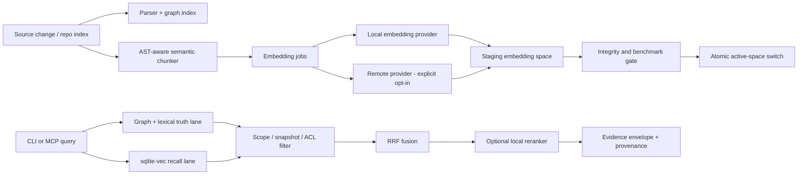

# Penguin Knowledge 强化路线图：持久化向量搜索与混合检索

> 日期：2026-08-31  
> 目标用户：Claude Code、Codex，以及通过 MCP/CLI 使用 Penguin 的内部工程团队  
> 基线：Round 17 已完成，内部可信度评分冻结为 `95/100`  
> 评审来源：Codex 源码与运行时核验、Claude Code 独立评审、DeepSeek 独立评审  
> 结论：向量搜索应进入下一阶段 P0/P1 路线图，但不能被描述为当前已支持的生产能力

## 1. 最直接的答案

之前没有把向量搜索塞进 Round 17，并不是认为它不重要，而是因为 Round 17 解决的是另一类问题：

- CLI 与 MCP 是否使用同一个 build、schema、capability contract 和 revision；
- 新 Claude Code/Codex 会话是否真的加载最新 MCP；
- `node ID`、cursor、context、flow、affected 是否可以跨进程复用；
- coverage 不完整时，系统是否诚实返回 `partial`、`lower_bound` 或 `not_proven`；
- 安装版是否能稳定运行，而不是只在源码工作区通过。

这些是“答案能不能信”的底座。Round 17 已保守达到 `95/100`，不应为了加入一个未完成的新检索通道而重新破坏这条可信基线。

向量搜索当时只有基础设施骨架，不是完整产品能力。若直接打开，会出现最危险的状态：界面或 capability 看起来支持 semantic search，真实运行时却没有向量、没有可用扩展，甚至在查询时临时计算部分文档的 embedding。这样的结果既不完整，也无法稳定复现。

因此正确顺序是：

1. 冻结 Round 17 的确定性可信基线；
2. 把向量搜索作为独立能力开发；
3. 默认关闭，通过实验开关和 benchmark 验证；
4. 达到全部质量、性能、一致性及回滚门槛后，才默认开启。

## 2. 当前真实状态

| 项目 | 当前事实 | 判断 |
| --- | --- | --- |
| Round 17 图/词法检索 | 安装版 G1–G9、全新 Claude Code/Codex 会话、CLI/MCP parity 均通过 | 可用于内部调查，`95/100` |
| `sqlite-vec` workspace 依赖 | `package.json` 声明 `sqlite-vec 0.1.9` | 只有开发依赖事实，不代表安装版可用 |
| 安装版 `sqlite-vec` | self-contained runtime 没有打包该 module | 生产不可用 |
| 向量表结构 | 已有 `semantic_chunks`、`embedding_models`、`semantic_embedding_refs`、`semantic_vector_values` | schema 骨架存在 |
| VectorStore | 类与 sqlite-vec/JSON fallback 代码存在 | 尚未进入正式端到端路径 |
| 正式 CLI/MCP 查询 | 仍调用同步 `searchKnowledge()` | 没有使用持久化向量检索 |
| async semantic 路径 | 查询时最多读取 1,000 份文档并临时 embedding | 不可扩展，且候选有偏差 |
| 真实数据库 | models `0`、chunks `0`、ready refs `0`、vectors `0` | 当前没有可查询的生产向量 |
| 本地 embedding provider | 有模型文件/配置验证概念，但没有完整推理链路 | 默认本地尚未落地 |
| 远端 embedding | 模型标识未可靠锁定实际权重版本 | 可能发生向量空间漂移 |

结论：Penguin 当前支持的是强确定性图检索和词法检索；它拥有向量搜索的设计与部分代码骨架，但不能说“已经支持可用的生产向量搜索”。

## 3. 为什么不能直接打开现有向量代码

### 3.1 安装包没有真正携带 sqlite-vec

开发工作区能解析一个依赖，不等于 Tauri 安装版的 self-contained runtime 也能解析。当前安装 runtime 无法加载 `sqlite-vec`。如果直接启用：

- 开发环境可能通过；
- 用户安装后失败；
- CLI 与 MCP 可能走不同 fallback；
- 新 session 的行为可能与测试 session 不一致。

这会直接破坏 Round 17 最重要的“同 build、同能力、同结果”保证。

### 3.2 正式查询路径没有接入持久化向量库

CLI 和 MCP 当前调用的是同步图/词法搜索。现有 async semantic 分支不是“从数据库查已生成向量”，而是查询时取一批文档再临时 embedding。它存在三个问题：

- 最多取 1,000 份文档，真正相关文件可能根本没进入候选；
- 查询延迟与模型推理成本不可控；
- 同一个 query 在缓存、文档顺序或环境变化后可能得到不同结果。

正确方式必须是“索引时生成，查询时只读取”。

### 3.3 Chunk identity 可能覆盖来源证据

当前 chunk ID 只取决于内容 hash。两个文件出现完全相同的代码或说明时，可能共享 ID，并覆盖 `source_blob_id`、`node_id` 或 locator。这不只是显示错误，也可能导致：

- 结果指向错误文件；
- snapshot provenance 错误；
- ACL scope 泄漏；
- 删除一个文件时误删另一个文件仍需要的向量。

Chunk identity 必须包含 repo、文件、符号/span、内容 hash 和 chunker version。

### 3.4 生命周期与模型版本还不完整

目前还缺少经过生产验证的：

- 向量写入、删除、重建和 orphan GC；
- embedding job 的 pending/ready/failed 状态；
- active/staging/retired 模型 generation；
- 模型升级时双写、切换和回滚；
- 本地模型真实推理 provider；
- 远端模型真实权重、维度、tokenizer、pooling 与 normalization 指纹。

只按 provider/model/endpoint 生成 hash 不够。同名远端模型若静默升级，旧向量与新 query embedding 可能已不在同一个向量空间。

## 4. 三方独立评审结果

### 4.1 Claude Code 评审

Claude Code 的判断是“应该加入，但必须按独立阶段交付”。它把当前状态定义为悬空半成品：schema、依赖和 VectorStore 存在，但安装运行时没有扩展、正式路径没接入、真实向量数量为零。

建议优先级：

1. P0：关闭查询期临时 embedding；capability 明确报告 semantic unavailable；
2. P1：索引期离线 embedding，并把 sqlite-vec 随 runtime vendoring；
3. P2：通过统一 async 搜索入口接入 hybrid fusion，继续保证 CLI/MCP parity；
4. P3：完成本地推理 provider、模型版本及 provenance。

它特别强调：

- graph + lexical 必须继续作为 truth lane；
- vector 只能作为 recall lane；
- sqlite-vec 加载失败应 fail-closed，不能静默退到无界 JSON 全量余弦；
- 模型迁移应创建新 embedding space，完成 backfill 后原子切换；
- 一名工程师加 AI agents，实验版约 `3–4 周`，默认开启且可发布约 `5–6 周`。

### 4.2 DeepSeek 评审

DeepSeek 同样认为 Round 17 不应仓促开启向量搜索，否则会破坏已稳定的 95 分基线。它要求先解决：

- chunk identity 冲突；
- 删除/重建后的向量孤儿；
- 安装版 sqlite-vec 打包和启动加载验证；
- 远端模型权重版本锁定；
- 一个真正可工作的默认本地 embedding provider。

DeepSeek 支持 SQLite + sqlite-vec 的持久化双轨架构，并要求图、词法和向量更新具备一致性校验、增量重建和回滚。它给出的完整交付估计较保守，为 `6–8 周`。

### 4.3 共识、差异与最终取舍

| 项目 | Claude Code | DeepSeek | Codex 最终取舍 |
| --- | --- | --- | --- |
| 是否应加入向量搜索 | 是 | 是 | 是，正式列为下一阶段 P0/P1 |
| 是否能直接打开现有代码 | 否 | 否 | 否 |
| 默认架构 | SQLite + sqlite-vec hybrid | SQLite + sqlite-vec hybrid | 采用 |
| graph/lexical 定位 | truth lane | 确定性主通道 | 采用 |
| vector 定位 | recall lane | 候选召回 | 采用 |
| 缺扩展时行为 | fail-closed | 启动验证失败 | capability 降级为 unavailable；不冒充 semantic |
| JSON 全扫 fallback | 仅 debug | 不作为主路径 | 生产禁用 |
| 时间 | 3–4 周实验；5–6 周发布 | 6–8 周完整交付 | 6 周目标，8 周风险上限 |

## 5. 方案选择

| 方案 | 优点 | 缺点 | 决策 |
| --- | --- | --- | --- |
| A. SQLite + sqlite-vec 持久化混合检索 | 本地优先、单文件部署、与现有 snapshot/transaction 接近、隐私边界清楚 | 原生扩展跨平台打包较复杂；需要完整 lifecycle | **推荐** |
| B. 外部向量数据库 | 水平扩展、成熟 ANN 与运维能力 | 增加服务、认证、数据外发、部署和版本一致性问题 | 暂不采用；未来超大团队部署再评估 |
| C. 继续只有 graph + lexical | 最稳定、最可解释、无需 embedding | 对概念意图、同义词和自然语言问题召回不足 | 保留为基线和强制回滚模式，不能作为长期终点 |

推荐采用 A，但必须保留 C 作为 truth baseline 和一键回滚模式。

## 6. 目标架构



核心规则：

1. 索引时 embedding，查询时不得调用 embedding provider；
2. 所有 query 最终经过同一个 async engine，CLI/MCP 只做 transport adapter；
3. exact symbol、route、node ID 和 proven graph edge 优先，不得被 semantic score 挤走；
4. 向量结果必须带来源、snapshot、model space、chunk version 和 locator；
5. scope/ACL 过滤应尽可能在 SQL/vector query 中完成，不能先取全局结果再事后裁剪；
6. 返回结果明确标注来自 `exact`、`lexical`、`graph`、`vector` 或 `rerank`；
7. vector-only 命中只能用于“建议检查”，不能单独证明调用关系或不存在关系。

## 7. 数据模型与身份设计

### 7.1 Chunk ID

推荐 canonical input：

```text
repo_id
+ canonical_file_path
+ symbol_id or stable span
+ content_hash
+ chunker_version
```

最终 ID 可以是上述字段的 hash，但 provenance 字段仍须独立保存，不能只保留不可解释的 hash。

### 7.2 Embedding space identity

```text
provider
+ model_name
+ weights_digest or immutable remote revision
+ tokenizer_digest
+ dimensions
+ pooling
+ normalization
+ chunker_version
```

任何字段变化都应生成新的 `embedding_space_id`。禁止把不同空间的向量混在同一搜索集合中。

### 7.3 生命周期状态

建议增加或明确以下状态：

| 实体 | 状态 |
| --- | --- |
| Embedding generation | `staging`、`active`、`retired`、`failed` |
| Embedding job | `pending`、`running`、`ready`、`failed`、`deleting` |
| Chunk | `current`、`superseded`、`deleted` |
| Provider health | `ready`、`unavailable`、`degraded` |

切换模型时的流程：新 space 建立 → 增量/全量 backfill → 完整性检查 → benchmark → 原子切换 active pointer → 保留旧 space 供回滚 → 延迟 GC。

## 8. 检索与排序策略

### 8.1 查询分类

| Query 类型 | 首选通道 | Vector 作用 |
| --- | --- | --- |
| 精确 node ID、symbol、route | exact/graph | 不参与或仅补充说明 |
| caller/callee/flow/affected | graph | 不得改变 proven edge，只补充候选入口 |
| 错误字符串、配置 key、API 名称 | lexical | 同义表述补召回 |
| “哪里处理玩家冻结？”一类概念问题 | lexical + vector | Vector 作为主要候选扩召 |
| 跨服务业务意图 | graph + lexical + vector | Vector 找入口，graph 验证关系 |
| 负面结论 | coverage + graph proof | Vector 不能证明不存在 |

### 8.2 Fusion

第一版推荐 Reciprocal Rank Fusion（RRF），因为它不要求不同检索器的分数天然可比。所有参数，如 `topK`、RRF constant、exact boost、rerank 开关，应进入 capability hash 或 search configuration fingerprint，保证可复现。

第二阶段可比较 calibrated weighted fusion 或本地 cross-encoder reranker，但只有 benchmark 证明它改善质量且不破坏延迟时才启用。

### 8.3 输出证据

每个结果至少包含：

- repo、branch、commit、snapshot；
- file、line/span、symbol/node；
- chunker version、embedding space；
- retrieval lanes 与每条 lane 的 rank；
- graph proof status、coverage、freshness；
- exact/semantic 的区别；
- 可复制的下一步 `context`、`flow` 或源码命令。

## 9. 本地模型与隐私策略

不在第一版路线图中硬编码某个“最新最好”的模型。模型选择应由 Penguin 自己的代码问题金标集决定，而不是只看公开 leaderboard。

最低要求：

- 默认本地 provider；
- arm64/x64 可安装、可离线运行；
- 记录模型文件 digest、tokenizer、维度与 normalization；
- 支持 batch、取消、超时、OOM 降级与进度恢复；
- 用户选择远端 provider 时必须显式 opt-in；
- 远端请求只发送允许的 chunk，不能发送凭证、`.env`、密钥或被 ACL 排除的代码；
- capability/doctor 清楚显示本地或远端、模型版本、数据是否离开机器。

候选模型必须用真实内部 corpus 做 bake-off，再决定默认值。选型门槛包括检索质量、macOS CPU/Metal 支持、包体积、许可证、冷启动与增量吞吐。

## 10. 分阶段执行计划

### Phase 0：诚实能力与止血（2–3 天）

- production capability 根据真实 runtime 和数据库状态返回：
  - `semantic.available=false`；
  - `degradedReason=SQLITE_VEC_MISSING`、`NO_ACTIVE_MODEL` 或 `NO_READY_VECTORS`；
- 删除或禁用查询期临时 embedding 路径；
- JSON 全量余弦只保留显式 debug/test 模式；
- `doctor` 输出 model/chunk/ref/vector/orphan 数量；
- 固定 Round 17 graph/lexical baseline fixture。

退出条件：关闭 semantic 时，CLI/MCP 结果逐字回到 Round 17 基线；任何环境都不能假装 semantic 已可用。

### Phase 1：身份、生命周期与 sqlite-vec 打包（4–6 天）

- 修复 chunk identity 和 provenance；
- 建立 embedding space 完整 fingerprint；
- 建立 staging/active/retired generation；
- 修复删除、重建和 GC，保证虚拟表及 JSON/metadata 无孤儿；
- 将 sqlite-vec vendoring 进 self-contained runtime；
- 首先通过 macOS arm64/x64 native smoke test。

退出条件：安装版启动检查能真正加载 sqlite-vec；故意删除或损坏扩展时 fail-closed，错误码稳定。

### Phase 2：本地 Provider 与索引期 Embedding（4–6 天）

- 实现一个完整本地 embedding provider；
- AST/symbol-aware chunking；
- backfill queue、batching、checkpoint、resume、cancel；
- 源文件变化时只更新受影响 chunks；
- 删除文件和 snapshot retirement 时安全回收；
- 远端 provider 保持 opt-in，不阻塞本地 MVP。

退出条件：真实目标 repo 的 chunks、ready refs、vectors 一致且大于 0；查询期间 provider 调用次数严格为 0。

### Phase 3：统一混合检索（3–5 天）

- CLI/MCP 改为同一个 async search engine；
- graph + lexical 与 vector 并行；
- snapshot、repo、branch、ACL 过滤；
- RRF fusion、exact boost、lane metadata；
- `semantic=off|fallback|blend` 行为明确；
- 相同 query/snapshot/config 的 CLI/MCP top-K 完全一致。

退出条件：parity gate 100% 通过；semantic 关闭时与 Round 17 baseline 无回归。

### Phase 4：模型迁移、Benchmark 与调优（4–6 天）

- 建立真实工程问题金标集；
- A/B 比较 graph+lexical 与 hybrid；
- 验证模型迁移、双空间切换和回滚；
- 故障注入：扩展缺失、维度不符、模型损坏、部分 backfill、磁盘不足；
- 测量质量、p50/p95、吞吐、数据库增长和 token 节省；
- 若必要，再评估本地 reranker。

退出条件：所有量化门槛通过，没有 hidden fallback 或 silent drift。

### Phase 5：Tauri UX、跨平台与默认开启（3–5 天）

- Settings 显示 provider、model、进度、ready vectors、磁盘和错误原因；
- Tauri build 后自动验证 app/CLI/MCP runtime 都能加载同一 sqlite-vec；
- 新 Claude Code/Codex session 重跑验收；
- Linux/Windows 进入平台矩阵；
- 实验开关灰度后才决定默认开启。

退出条件：全新安装、新索引、升级、模型迁移、回滚和卸载清理均通过。

## 11. 时间与资源估算

| 目标 | 现实时间（一名工程师 + AI agents） | 能力边界 |
| --- | --- | --- |
| 诚实状态 + 架构止血 | 2–3 天 | 仍没有向量搜索，但不会误报 |
| 默认关闭的实验版 | 3–4 周 | macOS 优先，可真实生成/查询向量，有基本 benchmark |
| 内部默认开启候选 | 约 6 周 | 质量、回滚、CLI/MCP parity、模型迁移完成 |
| 完整跨平台稳健版本 | 6–8 周 | 加入 Linux/Windows、更多故障与升级矩阵 |

这里的 `6 周` 是目标，不是承诺；`8 周` 是原生扩展打包、内部金标标注或模型性能不达标时的风险上限。不能通过删减一致性、ACL、provenance 或 rollback 测试来压缩工期。

## 12. 严格验收标准

### 12.1 数据完整性

- `models = 1 active`；
- `ready_refs = current_chunks`；
- `vector_rows = ready_refs`；
- orphan chunks/refs/vector rows 均为 `0`；
- 随机抽取至少 50 个 chunk，locator 可逐字回读对应源码 span；
- 100 次随机 add/change/delete/reindex 后，完整性仍通过。

### 12.2 检索质量

建立至少 200 条内部 query，覆盖：

- 精确 symbol/route/node；
- 业务概念与同义词；
- 跨服务 flow；
- “验证在哪里？”、“谁负责状态变化？”；
- dynamic/lower-bound；
- 负面和覆盖不完整场景。

必须达到：

- hybrid 相比 graph+lexical baseline 的 concept-query `Recall@10` 提升至少 `15%`；
- 总体 `MRR@10` 不下降；
- exact identifier/route/node top result 回归为 `0`；
- vector-only 结果不得被表达为 proven call/flow；
- CLI/MCP 相同 snapshot/config 的 top-10 和 metadata `100%` 一致。

### 12.3 性能与资源

第一阶段目标按真实机器 benchmark 后冻结，不用虚假固定数字代替测量。建议初始门槛：

- 100k chunks：warm query p95 `< 300ms`；
- cold query p95 `< 2s`；
- 单文件增量更新 p95 `< 2s`；
- query-time embedding 调用数 `0`；
- 完整 backfill 有进度、可暂停、可恢复；
- 向量数据库增长与模型文件占用在 UI/doctor 可见。

1M chunks 的目标应作为规模阶段单独 benchmark，不能用 100k 数据外推后直接宣称达标。

### 12.4 故障与回滚

- sqlite-vec 缺失、损坏、架构不匹配：semantic fail-closed，graph/lexical 继续可用；
- 模型文件损坏或维度不符：不切换 active space；
- backfill 中断：旧 active space 继续服务；
- semantic 开关关闭：结果回到 Round 17 baseline；
- 新模型质量不达标：active pointer 原子回滚；
- 旧 MCP session：报告 outdated，新 session 加载新 runtime。

## 13. 与 Obsidian、CodeGraph、Understand Anything、Graphify 的现实比较

> 以下是定位与公开能力边界比较，不是同仓库、同问题、同模型、同 token budget 的最新实机 benchmark。对外宣传前必须重新核对各竞品当时版本。

| 维度 | Penguin 完成此路线图后 | Obsidian | CodeGraph | Understand Anything | Graphify |
| --- | --- | --- | --- | --- | --- |
| 人工写作/个人知识管理 | 中 | **最强**，成熟 Markdown、插件和 Canvas | 弱 | 中 | 弱-中 |
| 精确代码关系 | **强**，graph truth lane | 弱 | **强** | 中-强 | **强** |
| 语义概念检索 | **目标强**，local vector + graph validation | 依赖插件/内容 | 需实测 | **强项方向** | 需按版本实测 |
| 跨 Repo/跨 Service | **差异化强项** | 弱 | 中-强，需实测 | 中 | 中-强 |
| Revision/freshness/coverage | **强且显式** | 不以代码 snapshot 为中心 | 需实测 | 需实测 | provenance 较强 |
| `not_proven` 保护 | **强** | 不适用 | 需实测 | 需实测 | 有 provenance 分类 |
| Claude/Codex 接入 | **CLI + MCP 同 contract** | 通常依赖插件 | MCP/IDE | Agent 工作流/插件 | CLI skill + MCP |
| 安装与 IDE 体验 | 仍需改进 | **成熟** | **可能更成熟** | 上手叙事较好 | 轻量直接 |
| 本地隐私 | **默认本地目标** | **强** | 取决于部署 | 取决于工作流 | **本地优先** |
| 企业运行证据/调查 handoff | **核心差异化** | 人工维护 | 需实测 | 偏 onboarding | 偏代码图 |

Penguin 仍然比不过它们的地方：

- 比不过 Obsidian 的编辑体验、插件生态、移动端和个人知识管理；
- 可能比不过 CodeGraph 的语言覆盖、IDE navigation 成熟度和普通开发者上手速度；
- 可能比不过 Understand Anything 的自动叙事、guided onboarding 和知识讲解体验；
- 可能比不过 Graphify 的轻量、开源传播、单 Repo 快速安装和产品简单度；
- Penguin 自己的向量能力在完成本路线图和 benchmark 前仍为弱项。

Penguin 最有机会做到近乎“完美”的部分：

- 一个安装包同步交付 app、CLI、MCP 与 runtime；
- Claude Code/Codex 在全新会话中获得同一能力与同一结果；
- 多 Repo、跨 Service、endpoint、symbol、revision、evidence 连成一条调查链；
- exact/graph 给事实，vector 提高自然语言召回，但不伪造证明；
- 空结果、覆盖不足、动态边界与 stale data 都明确说明；
- Agent A 的 node/cursor/handoff 能让 Agent B 直接继续。

## 14. GO / NO-GO 决策

### 现在

- Round 17 internal graph/lexical：`GO，95/100`；
- 对外发布：仍不在本计划范围；
- 生产向量搜索：`NO-GO`；
- 向量能力表述：只能说“基础设施开发中”，不能说“已支持”。

### 实验版 GO

必须满足 Phase 0–3，且：

- 安装版真实加载 sqlite-vec；
- 真实 corpus vectors > 0 且完整性通过；
- 查询期 embedding 为 0；
- CLI/MCP parity 100%；
- semantic off 可无损回到 Round 17。

### 默认开启 GO

必须再满足 Phase 4–5，质量提升、性能、故障注入、模型迁移、升级和全新 session 全部通过。任一项不通过，就继续保持默认关闭。

## 15. 最终建议

把向量搜索加进 Penguin，但不要把它当作一个 checkbox。它应被实现成一条可版本化、可审计、可关闭的 recall lane，并且永远不能削弱 graph/lexical truth lane。

推荐项目节奏：

```text
Round 17 可信基线（已完成，95/100）
    -> 2–3 天诚实状态与止血
    -> 3–4 周默认关闭实验版
    -> 约 6 周内部默认开启候选
    -> 最迟 8 周完成跨平台与高风险收口
```

这不是继续重复 Round 17，也不是重新移动 95 分门槛。它是下一项独立产品能力。完成后应该用新的 semantic/hybrid benchmark 评分，而不是把“有向量表”直接算成更高分。

## 16. 相关内部证据

- [Round 17 closure result](./index-evaluation-round17-closure-result.md)
- [Round 17 implementation plan](../superpowers/plans/2026-08-30-round17-penguin-95-trust-closure.md)
- [Penguin Wiki comparison](../knowledge-v2/penguin-wiki-comparison.md)
- [Capability matrix](../knowledge-v2/capability-matrix.md)
- [CLI reference](../knowledge-v2/cli-reference.md)
- [MCP reference](../knowledge-v2/mcp-reference.md)
